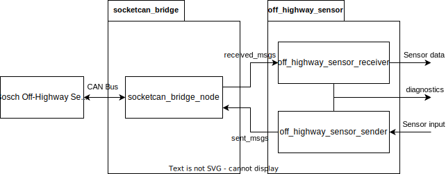

# off_highway_sensor_drivers

This project provides ROS drivers for Bosch Off-Highway sensor systems.

The off_highway_sensor_drivers package is developed for ROS 2 Humble on Ubuntu 22.04.

The [**off_highway_sensor_drivers**](off_highway_sensor_drivers/package.xml) package acts as
metapackage for all of the following packages.

## Ethernet Based Drivers

- [**off_highway_premium_radar**](off_highway_premium_radar/README.md): Driver library and node for
  the Bosch Radar Off-Highway Premium
- [**off_highway_premium_radar_msgs**](off_highway_premium_radar_msgs/README.md): The custom message
  interface for the off_highway_premium_radar package

For further information, have a look at the linked package readmes.

## CAN Based Drivers

- [**off_highway_can**](off_highway_can/README.md): Library containing receiver and sender
  classes to decode / encode sensor CAN frames
- [**off_highway_radar**](off_highway_radar/README.md): Receiver and sender nodes for the Bosch
  Radar Off-Highway
- [**off_highway_radar_msgs**](off_highway_radar_msgs/README.md): The custom message interface for
  the off_highway_radar package
- [**off_highway_uss**](off_highway_uss/README.md): Receiver and sender nodes for the Bosch
  Ultrasonic Sensor System Off-Highway
- [**off_highway_uss_msgs**](off_highway_uss_msgs/README.md): The custom message interface for the
  off_highway_uss package

The CAN communication based sensors were tested in a 500 kBd CAN configuration.

The CAN communication based drivers offer the possibility to [log processing cycle
times](off_highway_can/README.md). This allows you to check if your hardware in combination with
these drivers is capable of processing your system's specific CAN load.

For further information, have a look at the linked package readmes.

### Architecture

The most relevant packages for an application of the CAN communication based sensors are the
[**off_highway_radar**](off_highway_radar/README.md) and
[**off_highway_uss**](off_highway_uss/README.md) packages, which provide a `receiver` node to
convert CAN frames received from the sensor into ROS messages and a `sender` node to provide
relevant information as CAN frames, converted from a ROS message interface.

The sensor packages do **not** contain a CAN to ROS driver. Instead, their interface towards the
sensor side are encoded as
[`can_msgs/Frame`](http://docs.ros.org/en/noetic/api/can_msgs/html/msg/Frame.html) ROS messages.
Such messages can be handled by e.g., the
[ros2_socketcan](https://github.com/autowarefoundation/ros2_socketcan) sender and receiver, which
convert between such ROS messages and physical CAN frames through the SocketCAN driver. See the
following diagram for a system overview:



## Further Information about the Hardware

- [Radar OHW Premium](https://www.bosch-engineering.com/stories/stories-detailpages/hd-radar.html)
- [Radar systems for off-highway
  applications](https://www.bosch-mobility-solutions.com/en/solutions/assistance-systems/radar-systems-ohw/)
- [Ultrasonic system variants and
  sensors](https://www.bosch-mobility-solutions.com/en/solutions/assistance-systems/ultrasonic-sensor-systems-ohw/)

Or contact
[**off-highway.beg@bosch.com**](mailto:off-highway.beg@bosch.com?subject=off_highway_sensor_drivers%20Hardware%20Question).

## Intended Use

See [intended use](doc/intended_use.md).

## License

Please see [LICENSE](LICENSE).

## Build

### Prerequisites

Install:

- Ubuntu jammy 22.04
- ROS humble

### Install Dependencies

Clone this repository into your workspace and execute in it:

```bash
rosdep update && rosdep install --from-paths src --ignore-src -r -y
```

### Compile

Execute in your workspace

```bash
colcon build --cmake-args '-DCMAKE_BUILD_TYPE=Release'
```

for using colcon.
